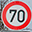
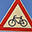

# **Classifying Traffic Signs using the [German Traffic Sign Dataset](http://benchmark.ini.rub.de/?section=gtsrb&subsection=dataset)**

---

**Build a Traffic Sign Recognition Project**

The goals / steps of this project are the following:
* Load the data set
* Explore, summarize and visualize the data set
* Design, train and test a model architecture
* Use the model to make predictions on new images
* Analyze the softmax probabilities of the new images
* Summarize the results with a written report

---

## Reflection

### Dataset

For this project I used the [German Traffic Sign Dataset](http://benchmark.ini.rub.de/?section=gtsrb&subsection=dataset).

* The size of training set is 34799
* The size of the validation set is 4410
* The size of test set is 12630
* The shape of a traffic sign image is 32x32x3
* The number of unique classes/labels in the data set is 43

### Design and Model Architecture

For the image preprocessing steps I converted the RGB images into grayscale. Since the CNN learns independently on which objects it has to focus in the image for classification, we have to preprocess the images to focus on the important parts. So in order to focus on the shape and other characteristics of the traffic sign instead of brightness, shading, etc. I did the conversion from RGB to grayscale. 
Afterwards I tweaked the epoch and batch size and defined the learning rate for the best possible results. I then trained the model with my training dataset. My neural network has two convolution layers and two fully connected layers. For the training dataset I defined a dropout rate to prevent overfitting.

My final model consisted of the following layers:

| Layer         		|     Description	        					| 
|:---------------------:|:---------------------------------------------:| 
| Input         		| 32x32x1 grayscaled image 						| 
| Convolution       	| 1x1 stride, valid padding, outputs 28x28x3 	|
| RELU					|												|
| Max pooling	      	| 2x2 stride, same padding, outputs 14x14x6 	|
| Dropout				|												|
| Convolution 3x3	    | 1x1 stride, valid padding, outputs 10x10x16	|
| RELU					|												|
| Max pooling	      	| 2x2 stride, same padding, outputs 5x5x16 		|
| Dropout				|												|
| Fully connected 1		| Output 120, dropout rate: 0.75    			|
| RELU					|												|
| Dropout				|												|
| Fully connected 2		| Output 84, dropout rate: 0.75     			|
| RELU					|												|
| Dropout				|												|
| Logits/Output layer   | Output 43 									|
 
After the train and valdiation process I tested my model against the test dataset. The accuracy is 91.6%.

* learning rate is 0.001
* epochs is 15
* batch size is 128
* dropout for train data is 0.75
* dropout for validation and test data is 1

My final model results were:
* training set accuracy of 99.2%
* validation set accuracy of 92.6% 
* test set accuracy of 91.6%

### Test a model on new images

Here are five German traffic signs that I found on the web:

")

The first four images were classified correctly which might be because of the clear combination between the symbol and the shape of the traffic sign. The "no entry" sign for example is clearly unique and there isn't really a similar traffic sign which makes it easier for the CNN to classify it.
The last image might be difficult to classify because the traffic sign is cropped and the "bicycles crossing" label might not have had enough images to train or the train images were either too different or not similar enough to my provided image. If we search for "bicycles crossing traffic sign" we can see that there are many different variations of that sign: yellow squares, red-white triangles or sometimes with stick figures included.
Also what's interesting to note on the "bicycles crossing"-sign are the top 5 largest probabilities:
1. Ahead only
2. Turn right ahead
3. No passing for vehicles over 3.5 metric tons
4. Road work
5. No passing

Here are the results of the prediction:

| Image			        |     Prediction	        					| 
|:---------------------:|:---------------------------------------------:| 
| Turn left ahead 		| Turn left ahead								| 
| Speed limit (70km/h)  | Speed limit (70km/h) 							|
| General caution       | General caution		     					|
| No entry	      		| No entry				    	 				|
| Bicycles crossing		| Ahead only        							|

The model was able to correctly guess 4 of the 5 traffic signs, which gives an accuracy of 80%. 

## Conclusion

The whole model architecture is inspired from [LeNet by Yann Lecun](http://yann.lecun.com/exdb/lenet/) which provides good results for the MNIST dataset. Anyway the model needed some extra customization for better performance on traffic signs. I did serveral runs and tweaked the model until I felt comfortable enough to try it on the five traffic signs that I have found on the web. 
I'm satisfied with my results but I think there are some more techniques that can deliver a higher accuracy on the validation and test dataset.
A possible improvement on image classification could be to apply affine transformation on the datasets because traffic signs are always a bit distorted when viewing from a different angle. I think it would be interesting too if the CNN was still able to classify the images if they were upside down.